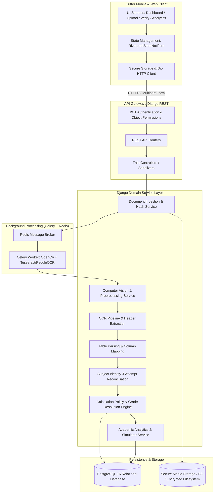
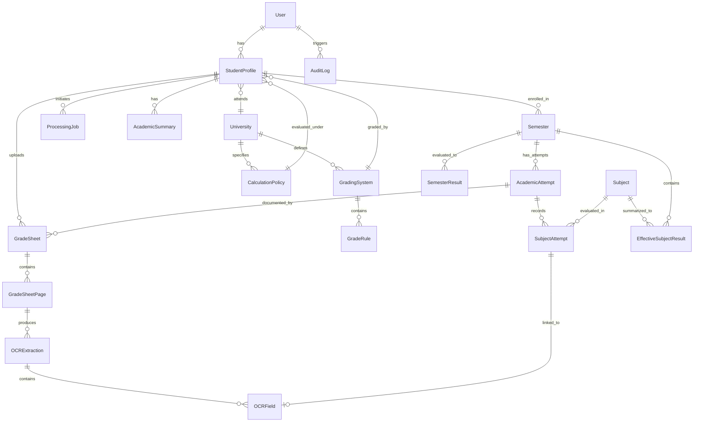
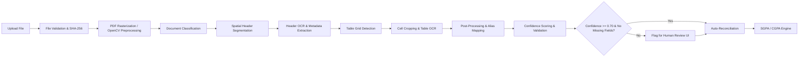
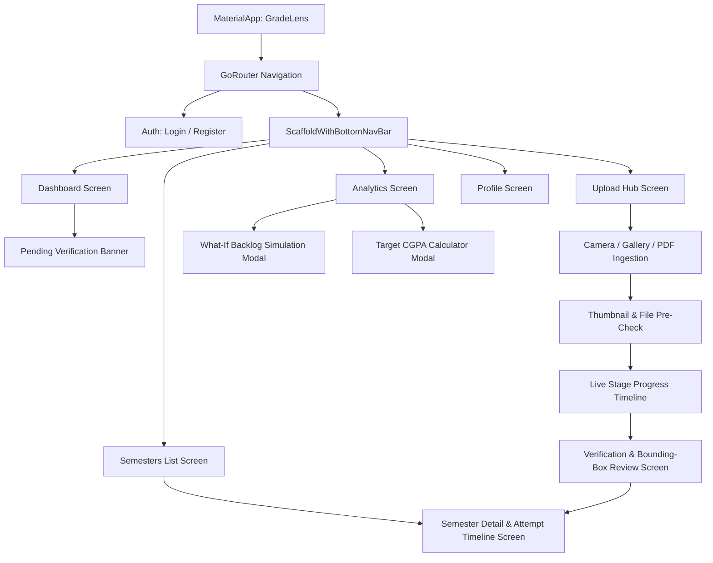

# GradeLens — System Architecture & Specification Document
**Version:** 1.0.0 (Enterprise Specification)  
**Author:** GradeLens Engineering Team & Architecture Board  
**Target Repository:** `morasantosh2007-rgb/CGPA_Calculator`  
**License:** MIT

---

## 1. Complete Product Requirements

### 1.1 Product Mission & Philosophy
GradeLens is an intelligent academic document intelligence and evaluation platform designed to eliminate the manual, error-prone entry of university grade sheets. GradeLens ingests physical photos, mobile camera captures, scanned sheets, and digital PDFs of multi-semester grade memos, performs automated computer vision and OCR, identifies semesters and examination types (Regular, Supplementary, Backlog, Revaluation), reconstructs grade tables, reconciles multi-attempt academic histories, and computes mathematically verified SGPA and cumulative CGPA.

**Core Axiom:** *Prioritize correctness and auditability over blind automation.* Academic records determine degrees, scholarships, and careers. The system must never guess silently; uncertain fields must be flagged for human verification with full visual audit trails.

### 1.2 Target Audience
1. **Undergraduate & Graduate Students:** Ingest entire academic histories across 4–8 semesters, including backlogs and improvements, to track accurate CGPA without double-counting credits.
2. **Academic Advisors & Mentors:** Analyze student progression curves, grade distributions, and backlog clearing timelines.
3. **Institutional Evaluators:** Audit multi-attempt transcripts against institutional calculation policies.

### 1.3 Key Value Differentiators
- **Content-Based Semester Identification:** Semesters are extracted from document headers and institutional labels (e.g., "III SEMESTER", "3rd B.Tech", "Semester End Examination"), not from upload order or filenames.
- **N-Attempts-Per-Semester Architecture:** Solves the multi-grade-sheet problem where supplementary and backlog sheets arrive months apart with subset subject lists.
- **Raw vs. Effective Result Separation:** Maintains every historical attempt ($F \to B \to A$) while resolving a single effective grade based on configurable university policies.
- **Strict Grading Precision:** Default scale natively supports $EX=10, A=9, B=8, C=7, D=6, P=5, M=4, F=0$ with zero silent conversions.

---

## 2. Functional Requirements (FR)

- **FR-1: Multi-Format Ingestion:** Ingest grade sheets as JPG, PNG, WEBP, and multi-page PDFs via mobile camera, device gallery, or file picker.
- **FR-2: Duplicate Detection:** Compute SHA-256 file hashes and perceptual hashes to prevent re-uploading identical documents.
- **FR-3: Document Preprocessing:** Automated deskewing, rotation correction, adaptive binarization, shadow attenuation, and resolution standardization.
- **FR-4: Document Classification:** Classify documents into `GRADE_SHEET`, `MARKS_MEMO`, `TRANSCRIPT`, `SUPPLEMENTARY_SHEET`, `REVALUATION_RESULT`, or `UNKNOWN_DOCUMENT`.
- **FR-5: Heading & Metadata Extraction:** Spatial segmentation of the header region (top 25–35%) to extract:
  - University/Institution Name
  - Academic Session / Year (e.g., "Nov/Dec 2023", "April 2024")
  - Examination Type (`REGULAR`, `SUPPLEMENTARY`, `BACKLOG`, `REVALUATION`, `IMPROVEMENT`, `REPEAT`)
  - Semester Number (Roman/Arabic normalized to integer $1 \dots 12$)
  - Student Identification (Name, Registration Number, Roll Number)
- **FR-6: Student Cross-Validation:** Compare extracted student metadata against the authenticated profile; flag mismatches before associating data.
- **FR-7: Subject Table Extraction:** Extract subject code, subject title, credits, internal/external marks, letter grade, and grade points using adaptive column mapping.
- **FR-8: Grade Normalization:** Normalize letter grades ($EX, Ex, E-X \to EX$; $M \to 4$). Flag unknown grades ($G \to UNKNOWN\_GRADE$).
- **FR-9: Confidence & Bounding-Box Tagging:** Attach character/field-level confidence scores ($[0.0, 1.0]$) and spatial coordinates ($[x, y, w, h]$) to every extracted value.
- **FR-10: Multi-Attempt Reconciliation:** Link supplementary attempts containing a subset of subjects to the parent semester, updating only relevant subjects without double-counting credits.
- **FR-11: Human Verification Interface:** Highlight low-confidence fields ($< 0.70$) and require user confirmation/correction before calculating results.
- **FR-12: Policy-Driven SGPA/CGPA Engine:** Compute SGPA per semester and overall CGPA using configurable institutional policies.
- **FR-13: Academic Analytics & Trends:** Calculate SGPA progression curves, grade point distributions, cumulative credit completion, and backlog clearing efficiency.
- **FR-14: What-If & Target CGPA Simulators:** Project CGPA if backlogs are cleared with hypothetical grades and calculate required average grade points for target CGPA.
- **FR-15: Transcript Export:** Generate audit-ready PDF summaries showing all raw attempts alongside effective results.

---

## 3. Non-Functional Requirements (NFR)

- **NFR-1 (Correctness & Precision):** All calculations must maintain IEEE 754 double precision floating-point arithmetic or Python `Decimal` with rounding to two decimal places ($0.01$). Credit sums must be exact integers or fixed-point decimals.
- **NFR-2 (Latency):**
  - OCR extraction turnaround: $< 5$ seconds per image page on server.
  - Calculation engine execution: $< 50$ milliseconds for an 8-semester profile.
- **NFR-3 (Data Privacy & Tenant Isolation):** Grade sheets contain personally identifiable academic information (PII). Strict object-level permissions must guarantee that Student A can never access or query Student B's documents or results.
- **NFR-4 (Auditability):** Every modification—whether from OCR, automated policy resolution, or manual user correction—must be stored in an immutable audit log.
- **NFR-5 (Modularity & Pluggability):** The OCR engine must be decoupled behind an abstract provider interface (`OCRProvider`), enabling seamless switching between Tesseract, PaddleOCR, and Cloud Vision without modifying domain services.
- **NFR-6 (Security):** JWT access and refresh token lifecycle, encrypted token storage on mobile (`flutter_secure_storage`), strict file upload sanitization, and CORS enforcement.

---

## 4. Architecture Diagram



---

## 5. Database ER Design (PostgreSQL Normalized Schema)



### Table Definitions & Primary Keys
1. **`users_user`**: `id (UUID)`, `email`, `password_hash`, `is_active`, `date_joined`.
2. **`students_studentprofile`**: `id (UUID)`, `user_id (FK)`, `full_name`, `registration_number`, `roll_number`, `university_id (FK)`, `grading_system_id (FK)`, `calculation_policy_id (FK)`.
3. **`grading_gradingsystem`**: `id (UUID)`, `name`, `code` (e.g. `DEFAULT_EX_F`), `is_active`.
4. **`grading_graderule`**: `id (UUID)`, `grading_system_id (FK)`, `grade (VARCHAR 10)`, `grade_point (NUMERIC 4,2)`, `is_pass (BOOL)`, `counts_for_gpa (BOOL)`, `min_marks`, `max_marks`.
5. **`grading_calculationpolicy`**: `id (UUID)`, `code` (`POLICY_A_LATEST_PASS`, `POLICY_B_FROZEN_SGPA`, etc.), `name`, `description`.
6. **`semesters_semester`**: `id (UUID)`, `student_id (FK)`, `semester_number (INT 1-12)`, `status` (`IN_PROGRESS`, `COMPLETED`, `BACKLOGS_PENDING`).
7. **`semesters_academicattempt`**: `id (UUID)`, `semester_id (FK)`, `attempt_number (INT)`, `exam_type` (`REGULAR`, `SUPPLEMENTARY`, `BACKLOG`, `REVALUATION`, `IMPROVEMENT`), `academic_session (VARCHAR)`, `exam_date (DATE)`.
8. **`gradesheets_gradesheet`**: `id (UUID)`, `student_id (FK)`, `attempt_id (FK, Nullable)`, `file_hash (CHAR 64 SHA-256)`, `original_filename`, `file_path`, `upload_status`, `is_duplicate`.
9. **`subjects_subject`**: `id (UUID)`, `student_id (FK)`, `subject_code (VARCHAR 30)`, `normalized_code`, `subject_name (VARCHAR 255)`, `default_credits (NUMERIC 4,2)`.
10. **`subjects_subjectattempt`**: `id (UUID)`, `subject_id (FK)`, `academic_attempt_id (FK)`, `raw_grade (VARCHAR 10)`, `normalized_grade (VARCHAR 10)`, `grade_point (NUMERIC 4,2)`, `credits (NUMERIC 4,2)`, `is_pass (BOOL)`, `source_gradesheet_id (FK)`, `user_corrected (BOOL)`.
11. **`subjects_effectivesubjectresult`**: `id (UUID)`, `semester_id (FK)`, `subject_id (FK)`, `selected_subject_attempt_id (FK)`, `effective_grade`, `effective_grade_point`, `effective_credits`, `is_pass`, `calculation_policy_id (FK)`.
12. **`calculations_semesterresult`**: `id (UUID)`, `semester_id (FK)`, `attempt_id (FK, Nullable)`, `sgpa (NUMERIC 5,2)`, `total_credits_registered`, `total_credits_earned`, `has_backlogs`, `calculation_timestamp`.
13. **`calculations_academicsummary`**: `id (UUID)`, `student_id (FK)`, `cgpa (NUMERIC 5,2)`, `total_credits_completed`, `total_backlogs_count`, `cleared_backlogs_count`, `active_backlogs_count`.
14. **`processing_processingjob`**: `id (UUID)`, `student_id (FK)`, `gradesheet_id (FK)`, `status` (`QUEUED`, `PROCESSING`, `REVIEW_REQUIRED`, `COMPLETED`, `FAILED`), `stage`, `error_message`.
15. **`common_auditlog`**: `id (UUID)`, `user_id (FK)`, `entity_name`, `entity_id`, `action`, `old_values (JSONB)`, `new_values (JSONB)`, `timestamp`.

---

## 6. Semester / Attempt / Backlog Data Model

```
Student Profile
  │
  ├── Semester 1 (Completed, SGPA: 8.40)
  │     └── Attempt 1 (REGULAR, Exam: Nov-2022)
  │           └── Grade Sheet 1
  │                 ├── Mathematics-I (Credits: 4, Grade: A, GP: 9)
  │                 └── Physics (Credits: 4, Grade: B, GP: 8)
  │
  └── Semester 3 (Backlogs Pending -> Cleared, SGPA: 7.91)
        ├── Attempt 1 (REGULAR, Exam: Nov-2023)
        │     └── Grade Sheet A
        │           ├── Mathematics-III (Credits: 4, Grade: A, GP: 9)
        │           ├── DBMS (Credits: 3, Grade: B, GP: 8)
        │           ├── Operating Systems (Credits: 4, Grade: F, GP: 0)  <-- Backlog
        │           └── Computer Networks (Credits: 3, Grade: A, GP: 9)
        │
        └── Attempt 2 (SUPPLEMENTARY, Exam: Apr-2024)
              └── Grade Sheet B (Partial sheet containing only backlog)
                    └── Operating Systems (Credits: 4, Grade: B, GP: 8)  <-- Cleared!
```

### Reconciliation Mechanism
1. **Raw Historical Retention:** Attempt 1 retains `Operating Systems = F (GP=0)`. Attempt 2 records `Operating Systems = B (GP=8)`. Neither record is deleted or overwritten.
2. **Effective Result Mapping:** The engine identifies that `Attempt 2` is a later passing attempt for `Operating Systems` in `Semester 3`.
3. **Credit Integrity:** The denominator credit sum for Semester 3 remains $4 + 3 + 4 + 3 = 14$. OS credits are counted exactly once.
4. **Resultant Computation:**
   $$\text{SGPA}_{\text{Sem 3}} = \frac{(4 \times 9) + (3 \times 8) + (4 \times 8) + (3 \times 9)}{14} = \frac{36 + 24 + 32 + 27}{14} = \frac{119}{14} = 8.50$$

---

## 7. OCR Pipeline Architecture



### Detailed Pipeline Steps
1. **File Validation:** Enforce MIME type (`image/jpeg`, `image/png`, `application/pdf`), size limits ($\le 15\text{MB}$), and calculate SHA-256 hash to intercept exact duplicate uploads.
2. **Image Preprocessing (OpenCV):**
   - **Resolution Normalization:** Rescale image to a target density of 300 DPI ($\approx 2480 \times 3508$ pixels for A4).
   - **Deskewing:** Calculate text line orientation via Hough Line Transform or Minimum Bounding Box of contours; rotate to $0^\circ \pm 0.5^\circ$.
   - **Illumination Correction & Shadow Removal:** Compute background morphology (`cv2.morphologyEx` with large kernel) and divide foreground to remove camera shadows.
   - **Adaptive Binarization:** Apply Sauvola or Otsu thresholding with bilateral filtering to preserve faint table borders while eliminating paper noise.
3. **Document Classification:** Verify presence of academic keywords (`GRADE`, `MARKS`, `SEMESTER`, `RESULT`, `CONTROLLER OF EXAMINATIONS`). Reject non-grade-sheet documents (`UNKNOWN_DOCUMENT`).
4. **Header Detection:** Segment the upper region (top 25–35%) of the document.
5. **Subject Table Extraction:**
   - Detect horizontal and vertical lines using morphological structuring elements (`cv2.getStructuringElement(cv2.MORPH_RECT, ...)`).
   - Identify intersection points to establish column boundaries.
   - Map headers via alias dictionaries (`Course Code`, `Sub Code` $\to$ `subject_code`; `Credits`, `Credit`, `Cr` $\to$ `credits`; `Letter Grade`, `Grade` $\to$ `grade`).

---

## 8. Heading Detection & Parsing Strategy

The header section is extracted and parsed independently before subject processing:

### Spatial Region of Interest (ROI)
The header resides within the top coordinate range:
$$y_{\text{start}} = 0, \quad y_{\text{end}} = 0.35 \times H_{\text{document}}$$

### Regex Parsing Engine
```python
SEMESTER_PATTERNS = [
    # Roman numeral variations
    r"(?:SEMESTER|SEM)[\s\-:]+([IVXLCDM]+)\b",
    r"\b([IVXLCDM]+)[\s\-]+(?:SEMESTER|SEM)\b",
    # Arabic numeral variations
    r"(?:SEMESTER|SEM)[\s\-:]+(\d{1,2})\b",
    r"\b(\d{1,2})(?:ST|ND|RD|TH)?[\s\-]+(?:SEMESTER|SEM)\b",
    # Degree semester aliases (e.g. III B.TECH, 3rd B.TECH)
    r"\b([IVXLCDM]+|\d{1,2})(?:ST|ND|RD|TH)?[\s\-]+B\.?\s*TECH\b",
    # Word numerals
    r"\b(FIRST|SECOND|THIRD|FOURTH|FIFTH|SIXTH|SEVENTH|EIGHTH)[\s\-]+SEMESTER\b",
]

EXAM_TYPE_PATTERNS = {
    "REGULAR": [r"\bREGULAR(?:\s+EXAMINATION|\s+EXAM|\s+RESULTS?)?\b"],
    "SUPPLEMENTARY": [
        r"\bSUPPLEMENTARY(?:\s+EXAMINATION|\s+EXAM|\s+RESULTS?)?\b",
        r"\bSUPPLE(?:\s+EXAM|\s+EXAMINATION)?\b",
    ],
    "BACKLOG": [r"\bBACKLOG(?:\s+EXAMINATION|\s+EXAM|\s+RESULTS?)?\b"],
    "REVALUATION": [r"\bREVALUATION(?:\s+RESULTS?)?\b", r"\bRE-VALUATION\b"],
    "IMPROVEMENT": [r"\bIMPROVEMENT(?:\s+EXAMINATION)?\b"],
}
```

### Roman-to-Arabic Normalization Map
`{"I": 1, "II": 2, "III": 3, "IV": 4, "V": 5, "VI": 6, "VII": 7, "VIII": 8, "FIRST": 1, "SECOND": 2, "THIRD": 3, "FOURTH": 4, "FIFTH": 5, "SIXTH": 6, "SEVENTH": 7, "EIGHTH": 8}`

---

## 9. Subject Matching Strategy

To accurately link backlog and supplementary grades to previous failed attempts without corrupting unrelated subjects:

1. **Canonical Subject Code Matching (Primary):**
   - Remove spaces, hyphens, and convert to uppercase: `CS-301` $\to$ `CS301`, `18CS301` $\to$ `18CS301`.
   - Exact code match links the attempt automatically.
2. **Normalized Title Matching (Secondary Fallback):**
   - If subject code is missing or obscured by ink/fold artifacts, calculate text similarity over normalized subject titles.
   - Normalization: Remove stopwords (`and`, `&`, `lab`, `laboratory`, `theory`), strip punctuation, lowercase.
   - Metric: Token Sort Ratio / Levenshtein similarity $\ge 0.88$.
3. **Disambiguation Guard:**
   - A subject code ending in `L` or containing `LAB` is never matched with a theory course of the same root number (e.g., `CS301` Theory $\neq$ `CS301L` Practical).

---

## 10. Effective-Grade Calculation Strategy

GradeLens isolates **Raw Historical Data** from **Effective Academic Standing**:

### Calculation Policy Definitions
- **Policy A (`LATEST_PASSING_GRADE` - Default):**
  - If a student fails a course in Attempt 1 and passes in Attempt 2, the passing grade replaces the failing grade in both the current semester SGPA calculation and cumulative CGPA.
  - The failing attempt is preserved in the audit history.
- **Policy B (`FROZEN_SEMESTER_SGPA`):**
  - The historical semester SGPA reflects the performance at that specific exam session (including the $F$).
  - When calculating cumulative CGPA, the improved grade is utilized, and total earned credits update.
- **Policy C (`HIGHEST_GRADE_ACHIEVED`):**
  - In cases of voluntary improvement exams, if the student scores lower on the repeat attempt, the higher prior grade is preserved as effective.

### Resolution Algorithm
```python
def resolve_effective_results(subject_attempts, policy="LATEST_PASSING_GRADE"):
    """Group attempts by canonical subject and determine effective result."""
    grouped = collections.defaultdict(list)
    for attempt in sorted(subject_attempts, key=lambda a: a.attempt_date):
        grouped[attempt.canonical_code].append(attempt)

    effective_results = []
    for code, attempts in grouped.items():
        if policy == "LATEST_PASSING_GRADE":
            # Search for latest passing attempt; if none, take the latest attempt
            passing_attempts = [a for a in attempts if a.is_pass]
            selected = passing_attempts[-1] if passing_attempts else attempts[-1]
        elif policy == "HIGHEST_GRADE_ACHIEVED":
            selected = max(attempts, key=lambda a: a.grade_point)
        effective_results.append(selected)
    return effective_results
```

---

## 11. Exact Grading Configuration

The system uses the user's specific university grading scale as the **immutable default configuration**:

| Letter Grade | Grade Point | Pass Status | SGPA/CGPA Count | Description |
| :---: | :---: | :---: | :---: | :--- |
| **EX** | **10.0** | Pass (`True`) | Yes (`True`) | Excellent / Outstanding |
| **A** | **9.0** | Pass (`True`) | Yes (`True`) | Very Good |
| **B** | **8.0** | Pass (`True`) | Yes (`True`) | Good |
| **C** | **7.0** | Pass (`True`) | Yes (`True`) | Fair / Above Average |
| **D** | **6.0** | Pass (`True`) | Yes (`True`) | Average |
| **P** | **5.0** | Pass (`True`) | Yes (`True`) | Pass (Minimum) |
| **M** | **4.0** | Pass (`True`) | Yes (`True`) | Marginal Pass |
| **F** | **0.0** | Fail (`False`) | Yes (`True`) | Fail / Backlog |

### Grade Normalization & Sanitation Rules
- `EX`, `Ex`, `ex`, `E X`, `E-X` $\to$ `EX`
- `A`, `a` $\to$ `A`
- `B`, `b` $\to$ `B`
- `C`, `c` $\to$ `C`
- `D`, `d` $\to$ `D`
- `P`, `p` $\to$ `P`
- `M`, `m` $\to$ `M` (Strictly maps to Grade Point 4.0; never treated as Missing or Absent)
- `F`, `f` $\to$ `F` (Grade Point 0.0)
- Any unrecognized grade (e.g. `G`, `S`, `O`, `AB`) $\to$ `UNKNOWN_GRADE` and triggers mandatory human verification.

---

## 12. SGPA Formula

Semester Grade Point Average (SGPA) is computed as the credit-weighted sum of grade points divided by the total registered credits for that semester:

$$\text{SGPA} = \frac{\sum_{i=1}^{N} (C_i \times GP_i)}{\sum_{i=1}^{N} C_i}$$

Where:
- $N$ = Number of effective subjects in the semester.
- $C_i$ = Credits assigned to subject $i$ ($C_i > 0$).
- $GP_i$ = Grade point earned in subject $i$.
- **Failed Subjects:** If a course is failed ($F$, $GP=0$), it contributes $C_i \times 0 = 0$ to the numerator, but $C_i$ is **fully included** in the denominator credit sum.
- **Zero-Credit Courses:** Audit courses with $C_i = 0$ do not affect SGPA.

---

## 13. CGPA Formula

Cumulative Grade Point Average (CGPA) is computed across all effective subjects completed by the student across all semesters:

$$\text{CGPA} = \frac{\sum_{j=1}^{M} (C_j \times GP_j)}{\sum_{j=1}^{M} C_j}$$

Where:
- $M$ = Total number of unique effective academic subjects across all semesters.
- **Anti-Pattern Warning:** GradeLens **never** calculates CGPA as the simple average of semester SGPAs:
  $$\text{CGPA} \neq \frac{\sum_{s=1}^{S} \text{SGPA}_s}{S} \quad (\text{Mathematically Invalid for Unequal Semester Credits})$$

---

## 14. Flutter Screen Architecture



### Screen Responsibilities & Design Standards
1. **Dashboard:** High-impact Material 3 hero card showing Current CGPA ($8.42$), Total Credits Completed ($142$), Active Backlogs ($0$), and Highest SGPA ($9.10$). Interactive spline chart showing SGPA progression over time.
2. **Upload Hub:** Supports multi-file selection, camera capture with edge-detection overlay, and drag-and-drop PDF ingestion. Displays document classification status in real time.
3. **Processing Timeline:** Visual step-by-step progress tracking:
   `Uploading` $\to$ `Preprocessing` $\to$ `Header Analysis` $\to$ `Table Extraction` $\to$ `Reconciliation` $\to$ `Ready`.
4. **Verification & Review Screen:** Side-by-side or stacked document inspection. Low-confidence cells ($< 0.70$) highlighted with orange caution indicators. Allows inline dropdown selection for grades and numeric inputs for credits.
5. **Semester & Attempt History Screen:** Displays chronological attempts per semester (e.g. Regular Exam Nov 2023 $\to$ Supplementary Exam Apr 2024) with visual indicators highlighting replaced backlogs.

---

## 15. Django Backend Architecture

The backend follows Clean Architecture and Domain-Driven Design (DDD) principles:

```
backend/
├── config/                  # ASGI/WSGI, settings, root URL router, celery config
├── apps/                    # Domain apps (Models, Views, Serializers)
│   ├── users/               # Custom User, authentication endpoints
│   ├── students/            # Student profiles, institutions
│   ├── grading/             # Grading systems, grade rules, calculation policies
│   ├── semesters/           # Semesters, academic attempts
│   ├── gradesheets/         # Uploaded documents, pages, raw metadata
│   ├── subjects/            # Subjects, raw attempts, effective results
│   ├── calculations/        # Calculation records, academic summaries
│   ├── processing/          # Processing jobs, status tracking
│   └── analytics/           # Progression metrics, simulation models
├── services/                # Pure business logic services (No HTTP/Request dependencies)
│   ├── ocr/                 # OCRProvider interface, Tesseract, PaddleOCR
│   ├── cv/                  # OpenCV deskew, binarization, shadow correction
│   ├── document/            # PDF rasterization, file hashing, classification
│   ├── extraction/          # Header detector, table grid finder, column mapper
│   ├── validation/          # Grade sanitizer, identity validator, credit checker
│   ├── matching/            # Subject canonical matcher, attempt reconciler
│   ├── calculation/         # SGPA/CGPA engine, policy resolver
│   └── analytics/           # Trend analyzer, what-if simulator
└── tests/                   # Comprehensive unit and integration test suite
```

---

## 16. REST API Design

### 16.1 Authentication & Profile
- `POST /api/auth/register/` — Register user with email and password.
- `POST /api/auth/login/` — Authenticate and issue JWT Access & Refresh tokens.
- `GET /api/profile/` — Retrieve student profile and university configuration.

### 16.2 Grade Sheet Ingestion & Processing
- `POST /api/grade-sheets/upload/` — Multipart upload for images/PDFs. Returns `ProcessingJob` ID.
- `GET /api/processing-jobs/{id}/` — Poll or stream WebSocket status updates for OCR pipeline stages.
- `GET /api/grade-sheets/{id}/review/` — Retrieve extracted fields, bounding boxes, and confidence scores for human verification.
- `POST /api/grade-sheets/{id}/verify/` — Submit confirmed/edited table data to trigger reconciliation and SGPA calculation.

### 16.3 Academic Records & Semesters
- `GET /api/semesters/` — List all semesters, SGPAs, and attempt counts.
- `GET /api/semesters/{id}/attempts/` — Detailed attempt history (Regular, Supplementary, Revaluation) with raw vs. effective grades.
- `PATCH /api/subject-results/{id}/` — Manual override for a specific subject result.

### 16.4 Analytics & Simulation
- `GET /api/academic-summary/` — Retrieve CGPA, total earned credits, backlog summary.
- `GET /api/analytics/progression/` — Retrieve SGPA/CGPA trends and grade distribution histogram.
- `POST /api/calculate/what-if/` — Simulate hypothetical backlog clearances on overall CGPA.
- `POST /api/calculate/target/` — Solve for required average grade point given a target CGPA.

---

## 17. Complete Folder Structure

### Flutter Architecture (`lib/`)
```
lib/
├── core/
│   ├── constants/           # API endpoints, grading rules, colors
│   ├── theme/               # Material 3 light and dark themes
│   ├── network/             # Dio client, interceptors, auth headers
│   ├── errors/              # Failure models, network exception handlers
│   └── utils/               # Currency, date, formatting helpers
├── features/
│   ├── auth/                # Login, Register, splash screens
│   ├── dashboard/           # Metrics cards, progression chart
│   ├── upload/              # Camera, file picker, upload queue
│   ├── processing/          # Live processing timeline screen
│   ├── verification/        # Table verification, confidence highlighter
│   ├── semesters/           # Semester list, attempt breakdown cards
│   ├── analytics/           # Performance charts, grade distributions
│   ├── simulator/           # What-if & Target CGPA calculators
│   └── profile/             # Profile info, institution settings
├── shared/
│   ├── widgets/             # Reusable buttons, cards, status chips
│   └── models/              # Immutable data transfer models
└── main.dart
```

### Django Architecture (`backend/`)
```
backend/
├── manage.py
├── config/
│   ├── __init__.py
│   ├── settings.py
│   ├── urls.py
│   ├── wsgi.py
│   └── celery.py
├── apps/
│   ├── users/
│   ├── students/
│   ├── grading/
│   ├── semesters/
│   ├── gradesheets/
│   ├── subjects/
│   ├── calculations/
│   ├── processing/
│   └── analytics/
├── services/
│   ├── ocr/
│   ├── cv/
│   ├── document/
│   ├── extraction/
│   ├── validation/
│   ├── matching/
│   ├── calculation/
│   └── analytics/
└── tests/
```

---

## 18. MVP Features (Phase 1–21 Scope)

1. User registration, login, and JWT token refresh.
2. Grade sheet image upload (JPG, PNG, PDF).
3. SHA-256 duplicate image detection.
4. Computer vision preprocessing (deskew, shadow removal, adaptive thresholding).
5. Header OCR and spatial extraction of Semester Number.
6. Extraction of Examination Type (`REGULAR` vs. `SUPPLEMENTARY`).
7. Table column detection and alias mapping (Subject Code, Title, Credits, Grade).
8. Exact default grading scale implementation ($EX=10 \dots F=0$).
9. OCR confidence scoring and human verification screen.
10. Semester SGPA calculation with credit weighting.
11. Multi-semester cumulative CGPA calculation.
12. Multi-grade-sheet reconciliation for the same semester (Regular $F \to$ Supplementary $B$).
13. Prevention of credit double-counting for backlog courses.
14. Material 3 Flutter UI with dark/light mode.

---

## 19. Advanced Features (Post-MVP Roadmap)

1. Celery + Redis distributed background processing queue.
2. Advanced deep-learning table extraction (Table Transformer / PaddleOCR Layout).
3. Revaluation and voluntary grade improvement tracking.
4. Multi-university grading presets (10-point, 4-point, percentage scales).
5. "What-If" Backlog Simulator and Target CGPA Achievability Calculator.
6. Exportable official audit transcript in encrypted PDF format.
7. Offline-first local SQLite caching in Flutter for immediate dashboard rendering.

---

## 20. Edge Cases & Resilience Strategy

1. **Supplementary Sheet Contains Only 1 Subject:** Treated as an atomic partial update; never overwrites unaffected subjects from the regular semester attempt.
2. **Student Fails Supplementary Exam Again ($F \to F \to B$):** All three attempts are preserved in `SubjectAttemptHistory`; effective grade remains $F$ until Attempt 3 clears it to $B$.
3. **Zero-Credit Audit / Non-Credit Courses:** Courses with $0$ credits (e.g. Environmental Studies) are recorded as Pass/Fail but excluded from SGPA/CGPA denominators.
4. **M Grade Encountered:** Validated strictly as Grade Point $4.0$; explicitly forbidden from being treated as "Missing" or "Absent".
5. **OCR Ambiguity ('B' vs '8', 'O' vs '0'):** Contextual type validators: Grades can only belong to $\{EX, A, B, C, D, P, M, F\}$; credits must be numeric floats/integers.
6. **Student ID Mismatch:** If extracted name or registration number disagrees with the user profile, processing pauses with a security warning to prevent cross-student record contamination.

---

## 21. Testing Strategy

### 21.1 Numerical Verification Test Suite
- **Exact Scale Test:**
  - Subject 1: Credits = $4$, Grade = $EX$ ($GP = 10$)
  - Subject 2: Credits = $3$, Grade = $A$ ($GP = 9$)
  - Subject 3: Credits = $3$, Grade = $B$ ($GP = 8$)
  - Total Credits = $10$
  - Calculated SGPA = $\frac{(4 \times 10) + (3 \times 9) + (3 \times 8)}{10} = \frac{40 + 27 + 24}{10} = \frac{91}{10} = \mathbf{9.10}$
- **Real-World Backlog Test:**
  - Attempt 1 (Regular): Math ($4$, $A=9$), DBMS ($3$, $B=8$), OS ($4$, $F=0$), Networks ($3$, $A=9$).
    $$\text{SGPA}_{\text{Regular}} = \frac{36 + 24 + 0 + 27}{14} = \frac{87}{14} = 6.21$$
  - Attempt 2 (Supplementary): OS ($4$, $B=8$).
  - Effective Reconciliation:
    $$\text{SGPA}_{\text{Effective}} = \frac{36 + 24 + 32 + 27}{14} = \frac{119}{14} = \mathbf{8.50}$$
    Credit sum remains $14$ (no double counting).

---

## 22. Security & Privacy Strategy

- **Tenant Isolation:** Django queryset filters enforce `student.user == request.user` on all document and calculation queries.
- **Media Protection:** Grade sheet image URLs are never served via public static endpoints; authenticated temporary pre-signed URLs or protected streaming views are required.
- **Data Retention & Anonymization:** Users have one-click options to export all parsed records and permanently purge uploaded image files.
- **Sanitized Logging:** PII (names, roll numbers, raw transcripts) is stripped from application error logs.

---

## 23. Incremental Development Roadmap (Phases 1–28)

- **Phase 1:** Architectural Blueprint & Requirements Verification (Current)
- **Phase 2:** Flutter Project Setup & Design System Setup
- **Phase 3:** Django Project & Clean Architecture Setup
- **Phase 4:** PostgreSQL Database Setup
- **Phase 5:** Normalized Domain Models & Migrations
- **Phase 6:** JWT Authentication & Tenant Security
- **Phase 7:** Pure Grading Configuration & Rules Engine
- **Phase 8:** Pure SGPA/CGPA Mathematical Calculation Engine
- **Phase 9:** Semester, Academic Attempt, & Reconciler Service
- **Phase 10:** Document Upload & Secure Storage Service
- **Phase 11:** Image Preprocessing (OpenCV Deskew & Filter Pipeline)
- **Phase 12:** OCR Engine Abstraction & Provider Implementation
- **Phase 13:** Header Detection & Semester Extraction
- **Phase 14:** Examination Type & Student Identity Extraction
- **Phase 15:** Subject Table Segmentation & Alias Mapper
- **Phase 16:** Confidence Scoring & Bounding-Box Generation
- **Phase 17:** Extracted Data Validation & Sanitization
- **Phase 18:** Backlog & Multi-Attempt Matching Engine
- **Phase 19:** Human Verification REST APIs & Review Flow
- **Phase 20:** Automated SGPA Calculation Integration
- **Phase 21:** Cumulative CGPA & Multi-Semester Consolidation
- **Phase 22:** Flutter Dashboard & Performance Spline Charts
- **Phase 23:** Academic Analytics & Progression Breakdown
- **Phase 24:** What-If & Target CGPA Simulators
- **Phase 25:** Official Academic PDF Report Generator
- **Phase 26:** Hardened Security, Rate Limiting & Audit Trail
- **Phase 27:** End-to-End Regression & Edge-Case Testing
- **Phase 28:** Production Packaging & Deployment Guide

---

## 24. Key Risks & Mitigation Matrix

| Risk Factor | Impact | Mitigation Strategy |
| :--- | :---: | :--- |
| **Mobile Photo Skew & Shadows** | High | Multi-stage OpenCV pipeline: background subtraction, Hough line deskew, adaptive Sauvola thresholding. |
| **Inconsistent University Column Names** | High | Dynamic alias dictionary with Levenshtein fuzzy header matching; fallback to user manual column assignment. |
| **Backlog Credit Double-Counting** | Critical | Strict canonical subject code indexing ensuring only one effective result per subject per semester contributes to credits. |
| **OCR Misinterpretation of Failing Grades** | Critical | Two-tier confidence threshold ($< 0.70 \to$ mandatory review); all $F$ and $M$ grades trigger confirmation prompt. |
| **Cross-Student Document Mixing** | Critical | Header identity check matching student name and registration number against profile; flags deviations immediately. |
